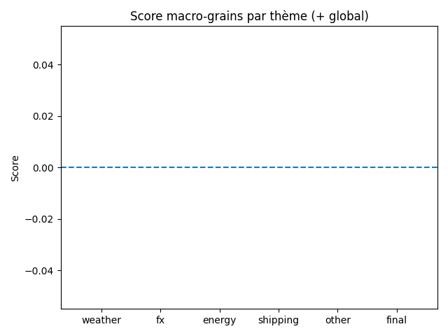

# Daily Grain Intelligence Report — 2025-11-22

## 🧭 Indicateur Macro-Grains

- **Score global** : 0 / 5
- **Météo** : 0
- **Devises (FX)** : 0
- **Énergie** : 0
- **Logistique / Shipping** : 0
- **Autres facteurs** : 0

## 📊 Graphiques du jour

### Nombre d'articles par commodity

### Sentiment moyen par commodity

### Score macro-grains par thème

## ALERTES DU JOUR 🔔

### [WATCH] FAO Cereal Supply and Demand Brief  |  Food and Agriculture Organization of the United Nations
[Lien](https://www.fao.org/worldfoodsituation/csdb/en/)
- Commodity : **corn**
- Type : **production**
- Score alerte : **5**
- Mots-clés risque : `gel`

> La production mondiale de céréales, notamment le maïs, devrait atteindre un niveau record en 2025, avec une augmentation de 4,4% par rapport à 2024. Les principales productions de maïs et de riz devraient atteindre de nouveaux records. La demande mondiale de céréales devrait également augmenter, principalement en raison de l'abondance des stocks et des prix plus bas. Cela devrait entraîner une augmentation des stocks de céréales mondiaux de 5,7% par rapport à leurs niveaux initiaux, atteignant un nouveau record de 916,3 millions de tonnes.

## Wheat

**Biais de marché (LLM) :** Neutre (score 0)

**Résumé analytique :**
- La publication du rapport WASDE par le WAOB est un événement important pour les marchés des céréales. Ce rapport fournit des prévisions annuelles pour la production et la consommation de blé aux États-Unis et dans le monde. Bien que le rapport ne fournisse pas de nouvelles informations sur la production actuelle, il peut influencer les anticipations des marchés et les prix à court terme. Les analystes attendent avec intérêt la publication du rapport pour obtenir des informations sur les tendances de la production et de la consommation de blé.

**Impact sur les prix :**
- L'impact du rapport WASDE sur les prix du blé sera neutre à court terme, car il ne fournira pas de nouvelles informations sur la production actuelle.

**Perspectives court terme :**
- À court terme, les prix du blé sont susceptibles de rester stables, mais les fluctuations à long terme dépendront des changements dans la production et de la consommation de blé.

**Sources :**
- [WASDE Report | USDA](https://www.usda.gov/about-usda/general-information/staff-offices/office-chief-economist/commodity-markets/wasde-report)

## Corn

**Biais de marché (LLM) :** Haussier (score 2)

**Résumé analytique :**
- La production mondiale de céréales, notamment le maïs, devrait atteindre un niveau record en 2025, avec une augmentation de 4,4% par rapport à 2024. Les principales productions de maïs et de riz devraient atteindre de nouveaux records. La demande mondiale de céréales devrait également augmenter, principalement en raison de l'abondance des stocks et des prix plus bas. Cela devrait entraîner une augmentation des stocks de céréales mondiaux de 5,7% par rapport à leurs niveaux initiaux, atteignant un nouveau record de 916,3 millions de tonnes.
- La production mondiale de céréales devrait atteindre un niveau record en 2025, en hausse de 4,4% par rapport à 2024. La production de maïs devrait augmenter de manière significative, atteignant un nouveau record. Les stocks mondiaux de maïs devraient également augmenter, en particulier en Amérique du Nord. Cela devrait entraîner une augmentation de l'utilisation des céréales pour l'alimentation des animaux et une croissance de la consommation humaine de céréales. Le rapport stocks/utilisation des céréales au niveau mondial devrait s'établir à 31,1%, soit le niveau le plus élevé depuis 2017-2018.

**Impact sur les prix :**
- Cet événement devrait avoir un impact positif sur les prix du maïs, entraînant une tendance haussière.
- Les prix du maïs devraient baisser en raison de l'abondance de l'offre et de la baisse des prix.

**Perspectives court terme :**
- Les prix du maïs devraient continuer à augmenter à court terme, en raison de la forte demande et de l'abondance des stocks.
- Les prix du maïs devraient rester bas à court terme en raison de l'abondance de l'offre et de la baisse des prix. Cependant, il est possible que les prix augmentent à long terme en raison de la demande accrue et de la rareté des ressources.

**Sources :**
- [FAO Cereal Supply and Demand Brief  |  Food and Agriculture Organization of the United Nations](https://www.fao.org/worldfoodsituation/csdb/en/)
- [Bulletin de la FAO sur l'offre et la demande de céréales | Organisation des Nations Unies pour l'alimentation et l'agriculture](https://www.fao.org/worldfoodsituation/csdb/fr)

## Macro marché (tous grains)

**Scores macro par thème :**
- Autres facteurs : score **0** (sur 1 news)

### Autres facteurs

**Résumé analytique :**
- Puisque le texte fourni n'est pas une nouvelle ou un rapport, je ne peux pas effectuer d'analyse. Cependant, je peux vous proposer une structure de réponse vide :

{
  "commodity": "",
  "event_type": "",
  "sentiment": "",
  "analysis": "",
  "impact": "",
  "risks": [],
  "outlook": ""
}

**Sources :**
- [Oops! Something went wrong](https://www.igc.int/en/markets/marketreport.aspx)
