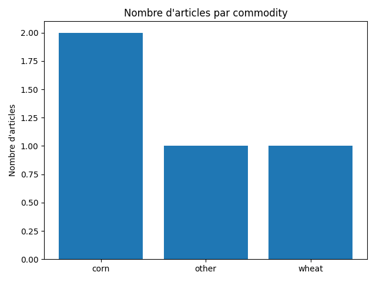
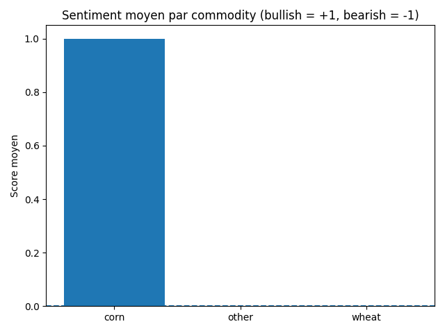

# Daily Grain Intelligence Report — 2025-11-23

## 🧭 Indicateur Macro-Grains

- **Score global** : 0 / 5
- **Météo** : 0
- **Devises (FX)** : 0
- **Énergie** : 0
- **Logistique / Shipping** : 0
- **Autres facteurs** : 0

## 📊 Graphiques du jour

### Nombre d'articles par commodity

### Sentiment moyen par commodity

### Score macro-grains par thème

## ALERTES DU JOUR 🔔

### [WATCH] FAO Cereal Supply and Demand Brief  |  Food and Agriculture Organization of the United Nations
[Lien](https://www.fao.org/worldfoodsituation/csdb/en/)
- Commodity : **corn**
- Type : **production**
- Score alerte : **5**
- Mots-clés risque : `gel`

> La production mondiale de céréales, notamment le maïs, devrait atteindre un niveau record en 2025, avec une augmentation de 4,4% par rapport à 2024. Les prévisions de production de maïs et de riz atteindront de nouveaux sommets. La demande mondiale de céréales devrait augmenter en 2025/26, principalement en raison de la disponibilité abondante et des prix plus bas. Les stocks mondiaux de céréales pourraient augmenter de 5,7% par rapport à leurs niveaux initiaux, atteignant un nouveau record de 916,3 millions de tonnes.

## Wheat

**Biais de marché (LLM) :** Neutre (score 0)

### Impact quantifié sur les prix

- Court terme (1–3 jours) : **+0.20% → +0.26%**
- Moyen terme (7–20 jours) : **+0.00% → +0.00%**
- Confiance du signal : **0.38**

**Résumé analytique :**
- La publication du World Agricultural Supply and Demand Estimates (WASDE) par le World Agricultural Outlook Board (WAOB) est un événement important pour les marchés des céréales. Ce rapport fournit des prévisions annuelles pour la production et l'utilisation de blé, riz, céréales grossières, oléagineux et coton aux États-Unis et dans le monde. Les analystes du WAOB compilent et interprètent des informations provenant de sources USDA et étrangères pour produire ce rapport. La publication de ce rapport peut avoir un impact significatif sur les prix des céréales, en particulier du blé.

**Impact sur les prix (narratif LLM) :**
- L'impact sur les prix du blé sera neutre à court terme, car le rapport WASDE ne fournit pas de nouvelles informations sur la production ou la demande de blé.

**Perspectives court terme :**
- À court terme, les prix du blé devraient rester stables, mais il est possible que des changements dans la politique agricole ou des événements météorologiques affectent la production et les prix du blé à long terme.

**Sources :**
- [WASDE Report | USDA](https://www.usda.gov/about-usda/general-information/staff-offices/office-chief-economist/commodity-markets/wasde-report)

## Corn

**Biais de marché (LLM) :** Haussier (score 2)

### Impact quantifié sur les prix

- Court terme (1–3 jours) : **+0.92% → +1.20%**
- Moyen terme (7–20 jours) : **+1.85% → +2.20%**
- Confiance du signal : **0.67**

**Résumé analytique :**
- La production mondiale de céréales, notamment le maïs, devrait atteindre un niveau record en 2025, avec une augmentation de 4,4% par rapport à 2024. Les prévisions de production de maïs et de riz atteindront de nouveaux sommets. La demande mondiale de céréales devrait augmenter en 2025/26, principalement en raison de la disponibilité abondante et des prix plus bas. Les stocks mondiaux de céréales pourraient augmenter de 5,7% par rapport à leurs niveaux initiaux, atteignant un nouveau record de 916,3 millions de tonnes.
- La production mondiale de céréales devrait atteindre un niveau record en 2025, avec une augmentation de 4,4% par rapport à 2024. La production de maïs devrait connaître la hausse la plus forte en glissement annuel. Les stocks mondiaux de maïs devraient augmenter de manière significative, en particulier en Amérique du Nord. Cela devrait entraîner une augmentation de l'utilisation des céréales pour l'alimentation des animaux et une croissance de la consommation humaine de céréales. Le rapport stocks/utilisation des céréales au niveau mondial devrait s'établir à 31,1%, soit le niveau le plus élevé depuis 2017-2018.

**Impact sur les prix (narratif LLM) :**
- Ces prévisions devraient avoir un impact positif sur les prix du maïs, entraînant une tendance haussière.
- Les prix du maïs devraient baisser à court terme en raison de l'abondance de l'offre et de la baisse des prix.

**Perspectives court terme :**
- Les prix du maïs devraient continuer à augmenter en 2025, en raison de la forte demande et de la production record.
- Les prix du maïs devraient rester bas à court terme en raison de l'abondance de l'offre et de la baisse des prix, mais pourraient connaître une hausse en raison de la demande accrue en fin d'année.

**Sources :**
- [FAO Cereal Supply and Demand Brief  |  Food and Agriculture Organization of the United Nations](https://www.fao.org/worldfoodsituation/csdb/en/)
- [Bulletin de la FAO sur l'offre et la demande de céréales | Organisation des Nations Unies pour l'alimentation et l'agriculture](https://www.fao.org/worldfoodsituation/csdb/fr)

## Macro marché (tous grains)

**Scores macro par thème :**
- Autres facteurs : score **0** (sur 1 news)

### Autres facteurs

**Résumé analytique :**
- Puisque le texte fourni n'est pas une nouvelle ou un rapport, je ne peux pas effectuer une analyse. Cependant, je peux vous proposer une structure vide pour un exemple :

{
  "commodity": "",
  "event_type": "",
  "sentiment": "",
  "analysis": "",
  "impact": "",
  "risks": [],
  "outlook": ""
}

**Sources :**
- [Oops! Something went wrong](https://www.igc.int/en/markets/marketreport.aspx)
